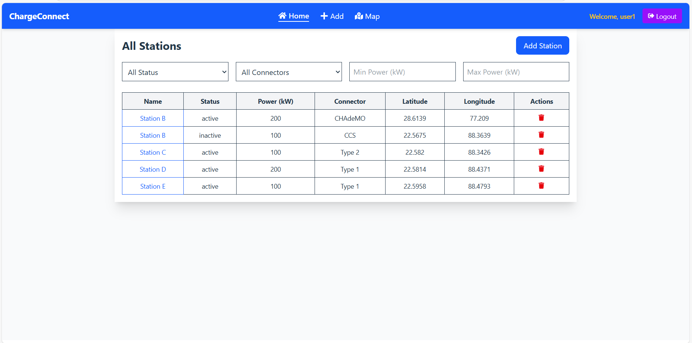
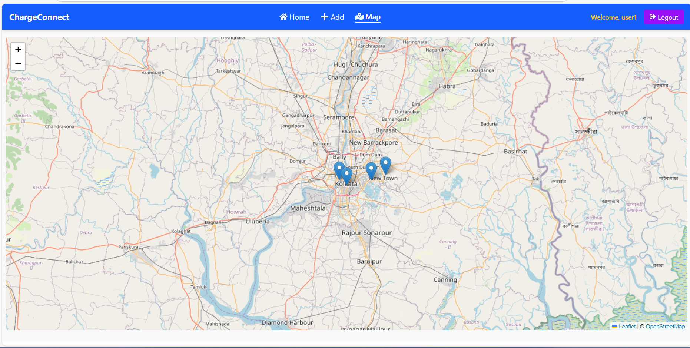
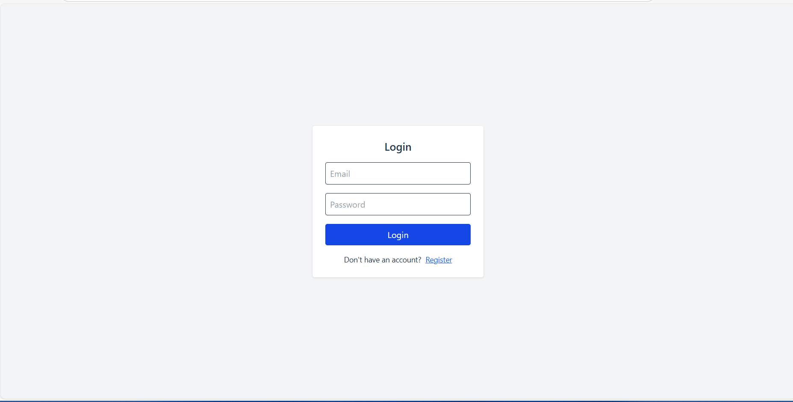

# ⚡ ConnectCharger

**ConnectCharger** is a full-stack MERN (MongoDB, Express, React, Node.js) web application that allows users to explore, add, and manage Electric Vehicle (EV) charging stations across various locations. It includes role-based access, real-time map integration, and filters for power output, connector type, and station status.


## 🌐 Live Demo

> 🚀 [View Live Application](https://evoltsoft-assignment-ncsm.vercel.app/)


## 📌 Features

- 🔍 **Browse All Charging Stations**
- 🗺️ **View Stations on Interactive Map**
- ➕ **Add New Charging Station**
- ✏️ **Edit Station Details**
- ❌ **Delete Station**
- 🔐 **Authentication & Logout**
- 📱 **Responsive Design with Mobile-Friendly Navbar**
- 📦 **Powerful Backend API with RTK Query**
- ✅ **Filter Stations by Status, Connector Type, Power Output**


## 👥 Guest Credentials

Try out ConnectCharger instantly using the following guest login:

```bash
📧 Email: user@gmail.com  
🔑 Password: 12345678
```

## 📸 Screenshots

### 🏠 Home Page


### 🗺️ View Map


### ➕ Login Station


## 🛠️ Tech Stack

### Frontend
- React.js
- Redux Toolkit & RTK Query
- React Router
- Tailwind CSS
- React Icons
- Leaflet (for map)

### Backend
- Node.js
- Express.js
- MongoDB with Mongoose
- JWT Authentication
- CORS, Dotenv, Helmet


## Run Locally

### Setup Backend

Clone the project

```bash
  git clone https://github.com/arijitbouri0/Evoltsoft_assignment

```

1.Navigate to Server Directory
```bash
  cd Server
```

2.Install dependencies
```bash
  npm install
```

3.Create a .env file and add:
```bash
  PORT=8000
  MONGODB_URI='your-mongodb-connection-string'
  JWT_SECRET='your-secret-key'
  CLIENT_URL='your-url'
```

4.Start the Backend Server
```bash
  npm run dev
```
### Setup Frontend

1.Navigate to the client folder:
```bash
cd ../client
```

3.Create a .env file and add:
```bash
BACKEND_SERVER='http://localhost:8000'
```

Install frontend dependencies:
```bash
npm install
```

Run the React App
```
npm run dev
```
## License

[MIT](https://choosealicense.com/licenses/mit/)


## Support

For support, email arijitbouri0@gmail.com .


